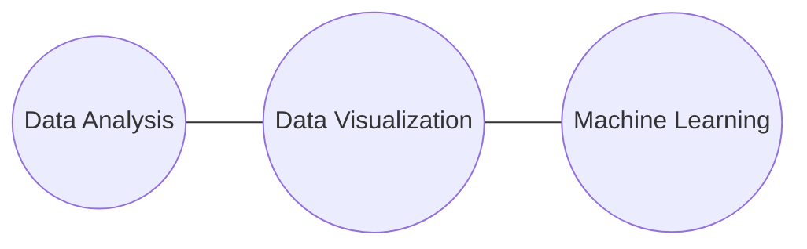

# Hi I'm Eric!
## **Husband - Father - Data Guy**
Hello there! My name is Eric and thanks for checking out my site :smile:. I am mainly a husband and father, but I also like to keep up with anything MCU-related. Oh, and I also like working with data. I'm a Machine Learning Engineer at [GitHub](https://github.com/), but I also dabble in some data-related freelancing and consulting!

### Ask Me About

## **Some Projects**

**[Pokemon Battle Prediction](portfolio/Classification%20Projects/Pokemon_Battle_Prediction.ipynb)**

:   Used [Kaggle Dataset ](https://www.kaggle.com/terminus7/pokemon-challenge)to build a model that predicts the winner between two pokemon. Utilized basic pre processing techniques, encoding, correlation analysis, feature selection and classification model comparison. After model comparison, implemented a model using Random Forest Classification.
    
    `Tech: Python, Scikit-Learn, XGBoost, Pandas`

**[Star Wars NLP Analysis](portfolio/NLP%20Projects/StarWarsNLP.ipynb)**

:   Used Star Wars scripts from the Orignial Trilogy to perform natural language processing and sentiment analysis. Utilized Bag of Words and Sentiment Intensity approach to classify Luke Skywalker lines as positive, neutral or negative.

    `Tech: Python, Pandas, Sklearn.feature_extraction, NLTK`

**[NBA Player of the Week Analysis](https://rpubs.com/ericbanta/nba_potw_eda)**

:   Used Kaggle Dataset to do some exploratory data analysis on the player of the week award in the NBA. Performed generic data cleansing and data manipulation tasks prior to analyzing data. Utilized dplyr for data manipulation, ggplot2 for data visualization and sqldf to showcase data manipulation skills using sql syntax.

    `Tech: R, Dplyr, Ggplot2, Sql (via sqldf)`
